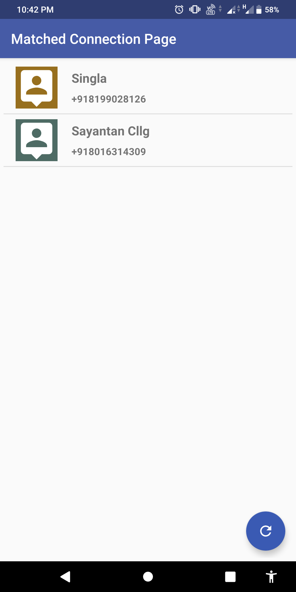

# Women_Safety_App_Encoders
## Description
A simple women safety app for the protection of you or your well-wishers. This app will help you in tracking your loved ones who are in danger. Also allow you to find nearby police station around you with just one tap.

   

## Features

* Add friend to whom you can send danger notification

* Track your friend when you received danger notification in your phone sent by your friend who is in danger.

 

* Send message to friend when you are in danger also can share live location atomatically when location services are on.

* List the previous location history of the matched connection.

* Show location of  all the nearby police station on google map integrated in app.
Also you can play police siren sound when you need it.

* Send snap of the nearby things for the better detection of the place in which you are trapped.

 

## Acknowledgement

* [Firebase Cloud Function](https://firebase.google.com/docs/functions): Run backend code in response to events triggered by                                                                            Firebase features and HTTPS requests.
* [Firebase Cloud Messaging](https://firebase.google.com/docs/cloud-messaging/): A cross-platform messaging solution.
* [Google Maps Platform](https://cloud.google.com/maps-platform/): For the maps interface
* [Retrofit](https://square.github.io/retrofit/"): A type-safe HTTP client for Android and Java
