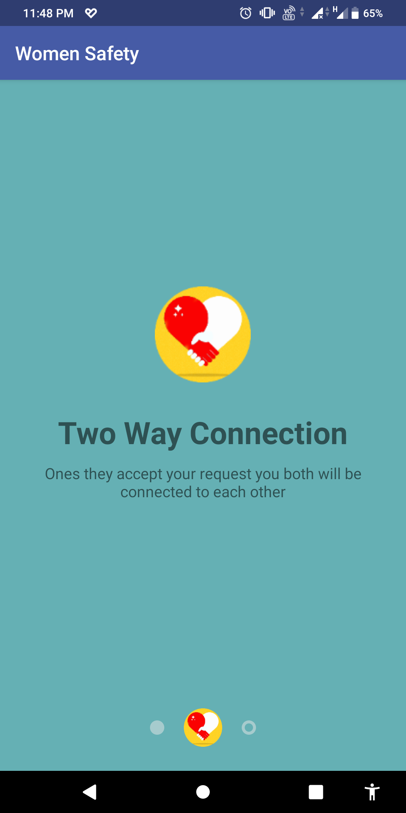

# Women_Safety_App_Encoders
## Description
Recently in these times, we come across various cases where womem are being molested, harassed, and even raped. And for worst, this numbers are very high. So we build a women safety app for the protection of you and your well-wishers. This app will help you in tracking your loved ones who are in danger and also allows you to share your location when you are in danger. Also allows you to find nearby police station around you with just one tap. It also allows to play Police siren to scare away the intruders and also you can share suspicious activity photos with your friends.

        

## Usage
For installation and usage of this application

Navigate to: /APK/WomenSafety.apk and install it in your android phones. <Recommended Android 6.0(M) version and above>

## Features

* Send invitation to your contacts and once they accept it, you two would be matched. Once you two are matched, you can share and receive one another's tracking details.

         

* Track your friend when you received danger notification in your phone sent by your friend who is in danger. Also SMS is sent to the friend.

   

* Send your location to your friend when you are in danger. Location updates also gets uploaded in background until and unless user explicitly cancel uploading.

   

* List the previous location history of the matched connection.

   

* Show location of  all the nearby police station on google map integrated in app.
Also you can play police siren sound when you need it.

   

* Send snap of the nearby things for better detection of the place in which you are trapped / when GPS not working. Also you can share photos of suspicious activities through ANY external medium (Whatsapp, Facebook, Instagram, Feed, Stories etc).

   

## Acknowledgement

* [Firebase Cloud Function](https://firebase.google.com/docs/functions): Run backend code in response to events triggered by                                                                            Firebase features and HTTPS requests.
* [Firebase Cloud Messaging](https://firebase.google.com/docs/cloud-messaging/): A cross-platform messaging solution. We used it to share location data between the users.
* [Firebase Realtime_Database](https://firebase.google.com/docs/database/): Realtime Cloud database provided by Firebase to be used by various users simultaneously. We used it to store the profile of the users and also making the connections between different users taking place.
* [Firebase Authentication](https://firebase.google.com/docs/auth/): Firebase Authentication provides backend services, easy-to-use SDKs, and ready-made UI libraries to authenticate users to our app. We used Phone Provider to validate user Phone with OTP. 
* [Google Maps Platform](https://cloud.google.com/maps-platform/): For the maps interface
* [Retrofit](https://square.github.io/retrofit/): A type-safe HTTP client for Android and Java
